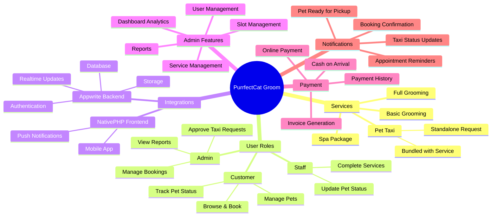
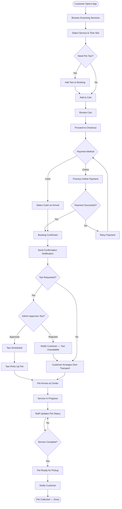
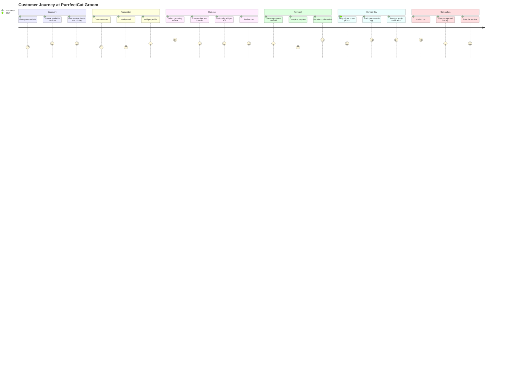

# PurrfectCat Groom — Mermaid Diagrams

## 1. Sitemap

```mermaid
graph TD
    ROOT["PurrfectCat Groom"]

    ROOT --> PUBLIC["Public Pages"]
    ROOT --> AUTH["Authentication"]
    ROOT --> SERVICES["Service Pages"]
    ROOT --> CHECKOUT["Checkout & Payment"]
    ROOT --> DASHBOARD["User Dashboard"]
    ROOT --> ADMIN["Admin Panel"]

    PUBLIC --> HOME[Home]
    PUBLIC --> ABOUT[About Us]
    PUBLIC --> CONTACT[Contact]
    PUBLIC --> FAQ[FAQ]
    PUBLIC --> GALLERY[Gallery]

    AUTH --> LOGIN[Login]
    AUTH --> REGISTER[Register]
    AUTH --> FORGOT[Forgot Password]
    AUTH --> VERIFY[Email Verification]

    SERVICES --> GROOMING[Grooming Services]
    GROOMING --> BASIC_GROOM[Basic Grooming]
    GROOMING --> FULL_GROOM[Full Grooming]
    GROOMING --> SPA[Spa Package]
    SERVICES --> TAXI_SERVICE[Pet Taxi Service]
    SERVICES --> SERVICE_DETAIL[Service Detail]
    SERVICES --> BOOKING[Booking / Slot Selection]

    CHECKOUT --> CART[Cart]
    CHECKOUT --> PAYMENT[Payment]
    PAYMENT --> ONLINE_PAY[Online Payment]
    PAYMENT --> CASH_PAY[Cash on Arrival]
    CHECKOUT --> CONFIRMATION[Booking Confirmation]
    CHECKOUT --> RECEIPT[Receipt / Invoice]

    DASHBOARD --> MY_BOOKINGS[My Bookings]
    DASHBOARD --> PET_STATUS[Pet Status Tracker]
    DASHBOARD --> MY_PETS[My Pets Profile]
    DASHBOARD --> HISTORY[Booking History]
    DASHBOARD --> NOTIFICATIONS[Notifications]
    DASHBOARD --> PROFILE[Profile Settings]

    ADMIN --> ADMIN_DASH[Dashboard Overview]
    ADMIN --> MANAGE_BOOKINGS[Manage Bookings]
    ADMIN --> MANAGE_SERVICES[Manage Services]
    ADMIN --> MANAGE_USERS[Manage Users]
    ADMIN --> MANAGE_TAXI[Manage Taxi Requests]
    ADMIN --> MANAGE_SLOTS[Manage Time Slots]
    ADMIN --> REPORTS[Reports & Analytics]
    ADMIN --> NOTIFICATIONS_ADMIN[Send Notifications]
```

## 2. Mindmap

```mermaid
mindmap
  root((PurrfectCat Groom))
    Services
      Basic Grooming
      Full Grooming
      Spa Package
      Pet Taxi
        Bundled with Service
        Standalone Request
    User Roles
      Customer
        Browse & Book
        Track Pet Status
        Manage Pets
      Admin
        Manage Bookings
        Approve Taxi Requests
        View Reports
      Staff
        Update Pet Status
        Complete Services
    Integrations
      Appwrite Backend
        Authentication
        Database
        Realtime Updates
        Storage
      NativePHP Frontend
        Mobile App
        Push Notifications
    Admin Features
      Dashboard Analytics
      Service Management
      Slot Management
      User Management
      Reports
    Payment
      Online Payment
      Cash on Arrival
      Invoice Generation
      Payment History
    Notifications
      Booking Confirmation
      Appointment Reminders
      Pet Ready for Pickup
      Taxi Status Updates
```

## 3. Flowchart — Booking Flow

```mermaid
flowchart TD
    START([Customer Opens App]) --> BROWSE[Browse Grooming Services]
    BROWSE --> SELECT[Select Service & Time Slot]
    SELECT --> NEED_TAXI{Need Pet Taxi?}

    NEED_TAXI -->|Yes| TAXI_REQ[Add Taxi to Booking]
    TAXI_REQ --> CART[Add to Cart]
    NEED_TAXI -->|No| CART

    CART --> REVIEW[Review Cart]
    REVIEW --> CHECKOUT[Proceed to Checkout]
    CHECKOUT --> PAY_METHOD{Payment Method}

    PAY_METHOD -->|Online| ONLINE[Process Online Payment]
    PAY_METHOD -->|Cash| CASH[Select Cash on Arrival]

    ONLINE --> PAY_SUCCESS{Payment Successful?}
    PAY_SUCCESS -->|Yes| CONFIRMED[Booking Confirmed]
    PAY_SUCCESS -->|No| RETRY[Retry Payment]
    RETRY --> PAY_METHOD

    CASH --> CONFIRMED

    CONFIRMED --> NOTIFY[Send Confirmation Notification]
    NOTIFY --> HAS_TAXI{Taxi Requested?}

    HAS_TAXI -->|Yes| TAXI_APPROVAL{Admin Approves Taxi?}
    TAXI_APPROVAL -->|Approved| TAXI_SCHEDULED[Taxi Scheduled]
    TAXI_APPROVAL -->|Rejected| NOTIFY_REJECT[Notify Customer — Taxi Unavailable]
    NOTIFY_REJECT --> SELF_TRANSPORT[Customer Arranges Own Transport]
    TAXI_SCHEDULED --> PICKUP[Taxi Picks Up Pet]
    PICKUP --> ARRIVE[Pet Arrives at Center]

    HAS_TAXI -->|No| SELF_TRANSPORT
    SELF_TRANSPORT --> ARRIVE

    ARRIVE --> IN_PROGRESS[Service In Progress]
    IN_PROGRESS --> STATUS_UPDATE[Staff Updates Pet Status]
    STATUS_UPDATE --> COMPLETE{Service Complete?}
    COMPLETE -->|No| STATUS_UPDATE
    COMPLETE -->|Yes| READY[Pet Ready for Pickup]
    READY --> NOTIFY_READY[Notify Customer]
    NOTIFY_READY --> COLLECTED([Pet Collected — Done])
```

## 4. Storyboard — Customer Journey

```mermaid
journey
    title Customer Journey at PurrfectCat Groom
    section Discovery
      Visit app or website: 3: Customer
      Browse available services: 4: Customer
      View service details and pricing: 4: Customer
    section Registration
      Create account: 3: Customer
      Verify email: 3: Customer
      Add pet profile: 4: Customer
    section Booking
      Select grooming service: 5: Customer
      Choose date and time slot: 4: Customer
      Optionally add pet taxi: 4: Customer
      Review cart: 4: Customer
    section Payment
      Choose payment method: 4: Customer
      Complete payment: 3: Customer
      Receive confirmation: 5: Customer
    section Service Day
      Drop off pet or taxi pickup: 4: Customer, Staff
      Track pet status in app: 5: Customer
      Receive ready notification: 5: Customer
    section Completion
      Collect pet: 5: Customer
      View receipt and history: 4: Customer
      Rate the service: 4: Customer
```
